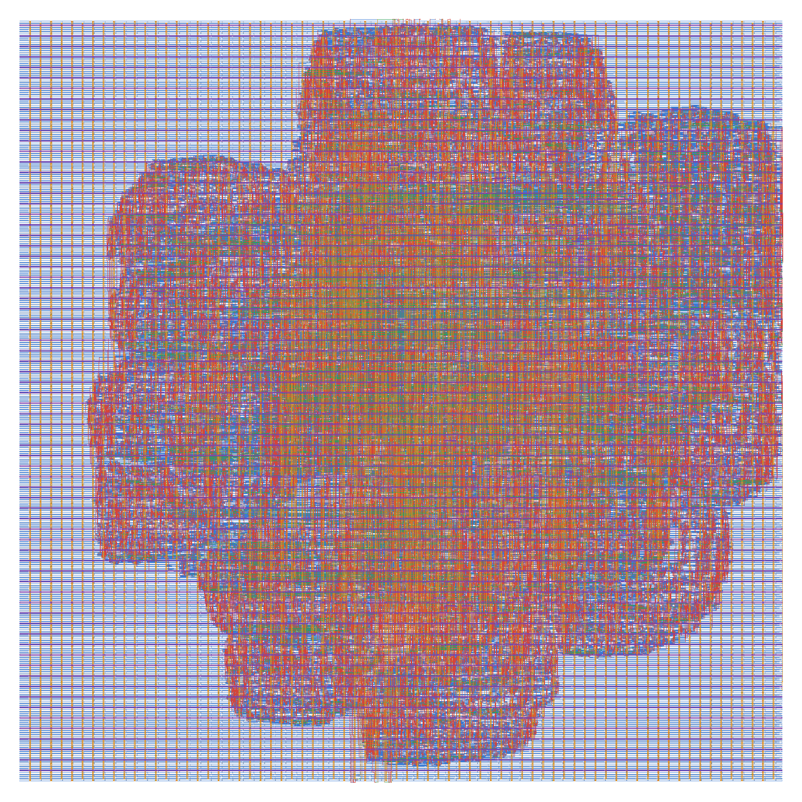
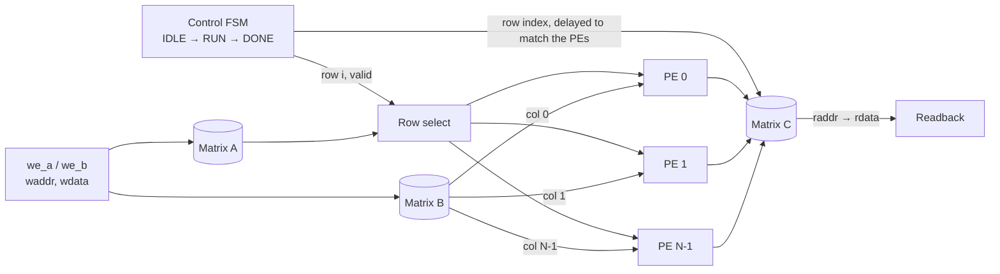
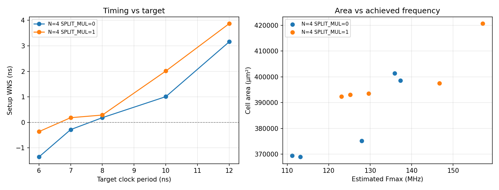

# matmul-accel-asic

A parameterized N×N matrix-multiply accelerator in SystemVerilog, taken from RTL to a finished
layout on the SkyWater 130 nm process with the open-source OpenROAD flow. The layout is DRC- and
LVS-clean and meets timing at the typical corner. One self-checking testbench passes at every
level: RTL, synthesized netlist, and routed netlist with back-annotated delays.

`SystemVerilog` · `Yosys` · `OpenROAD` · `OpenSTA` · `Magic` · `Netgen` · `SKY130` · `Tcl` · `Python`

## Results

Sign-off run: N = 4, 32-bit data, 12 ns clock target, typical corner (25 °C, 1.80 V).

| | |
|---|---|
| **Timing** | met: setup slack +3.16 ns, hold slack +0.03 ns, total negative slack 0 |
| **Cell area** | 368,923 µm² at 37.9 % utilization |
| **Power** | 21.5 mW |
| **Flip-flops** | 2,837 |
| **Design-rule check** | 0 errors (Magic, full SKY130 rule deck) |
| **Layout vs. schematic** | match (Netgen, 29,453 devices, 38,236 nets) |
| Router DRC · antenna · slew/capacitance/fanout | 0 · 0 · 0 |
| Post-layout simulation | pass, functional and with back-annotated delays |
| Critical path | operand register → 32×32 multiplier → product register, 9.48 ns |

Speed, from a ten-run clock sweep (see [Design study](#design-study--split-multiplier)):

| | Full multiplier | Split multiplier |
|---|---|---|
| Fastest clock target met | 8 ns (125 MHz) | 7 ns (143 MHz) |
| Estimated Fmax | ~137 MHz | ~157 MHz |

Evidence for every number: [`docs/reports/`](docs/reports/) and [`results/`](results/).
Full analysis: [docs/implementation.md](docs/implementation.md).



## Architecture



N processing elements (PEs), one per column of B. The controller streams one row of A per cycle
into all of them, so every row is in flight at once and one row of C comes out per cycle once the
pipeline fills. Each PE computes a dot product in three stages: operand register, N parallel
multipliers, adder tree. The row index travels alongside the data, so the controller never has
to count pipeline stages.

A full multiply takes **N + 4 cycles** (N + 5 with the split multiplier). Arithmetic wraps
modulo 2^DW.

| Parameter | Default | Meaning |
|---|---|---|
| `N` | 4 | matrix dimension, ≥ 2 |
| `DW` | 32 | data width |
| `SPLIT_MUL` | 0 | 1 = split each multiplier into two registered half-products: +1 cycle, shorter critical path |

Details: [docs/architecture.md](docs/architecture.md).

## Verification

| Check | Tool | Result |
|---|---|---|
| Lint, 6 configurations | Verilator 5.020 | no warnings |
| RTL simulation against a reference model | Icarus Verilog 12.0 | 166 / 490 / 1,786 checks pass (N = 2 / 4 / 8) |
| Testbench quality: 10 deliberately injected bugs | mutation script | 9 caught; the 10th cannot change behaviour |
| Generic synthesis | Yosys 0.33 | 61,315 cells, 0 latches |
| Gate-level simulation, synthesized netlist | Yosys + Icarus | 489 checks pass, both multiplier modes |
| Post-layout simulation, functional | Icarus + SKY130 cell models | 489 checks pass, both modes |
| Post-layout simulation, back-annotated delays | + OpenSTA SDF | pass at 12, 10 and 8 ns; fails at 6 ns, as a control |

The tests cover identity, overflow, zero and random matrices, back-to-back runs, writes and
`start` pulses during a run, and reset in the middle of a run. Latency, the one-cycle `done` pulse
and the `busy` flag are checked on every run. The mutation check shows the tests catch real
defects rather than merely passing.

The 6 ns run is a deliberate control. The critical path takes 9.48 ns, so the design must fail
at 6 ns. It does fail on the all-ones multiply, while the identity test still passes, which shows
the delays are really applied.

Details: [docs/verification.md](docs/verification.md).

## Design study — split multiplier

`SPLIT_MUL=1` rewrites `a·b` as `a·b_lo + (a·b_hi ≪ DW/2)` with both half-products registered,
which halves the depth of each multiplier. Ten flow runs: clock targets of 6, 7, 8, 10 and 12 ns
in both modes.



| | Full multiplier | Split multiplier |
|---|---|---|
| Fastest clock target met | 8 ns | 7 ns |
| Estimated Fmax | ~137 MHz | ~157 MHz |
| Cell area at 8 ns | 375,144 µm² | 393,491 µm² (+5 %) |
| Power at 8 ns | 32.5 mW | 39.8 mW (+22 %) |
| Latency | N + 4 cycles | N + 5 cycles |

**Finding:** the split multiplier buys about 15 % in frequency for 5 % more area, 22 % more power
and one cycle of latency. It was designed as a timing fix, but the full multiplier already meets
8 ns. At 7 ns only the split meets timing; at 6 ns neither does. Data:
[`results/sweep.csv`](results/sweep.csv).

## Reproduce

**RTL checks.** Lint, simulation, mutation check, synthesis and gate-level simulation in under
three minutes. No PDK needed.

```bash
make verify
```

**RTL to GDSII.** OpenROAD-flow-scripts in Docker. About 15 minutes and 3.7 GB of memory for the
default configuration.

```bash
WORK=$HOME/mm-work; mkdir -p "$WORK"
docker run --rm --user $(id -u):$(id -g) \
  -v "$PWD":/work -v "$WORK":/orfs_work \
  openroad/orfs:26Q3-589-gbc5af8cbd bash -c '
    source /OpenROAD-flow-scripts/env.sh > /dev/null && cd /work &&
    make asic   FLOW_HOME=/OpenROAD-flow-scripts/flow WORK_HOME=/orfs_work \
                CLOCK_PERIOD=12 FLOW_VARIANT=base LEC_CHECK=0 &&
    make report FLOW_HOME=/OpenROAD-flow-scripts/flow WORK_HOME=/orfs_work FLOW_VARIANT=base'
```

`LEC_CHECK=0` skips an optional equivalence check whose binary needs an AVX-512 CPU. It does not
affect any reported result. The clock sweep, standalone STA, DRC, LVS and post-layout simulation
are described step by step in [docs/implementation.md](docs/implementation.md).

**Outputs** land in the work folder: the layout (`6_final.gds`, open it with KLayout), the
placed-and-routed DEF and the routed netlist. The layout of the sign-off run is also attached to
the [v1.0 release](https://github.com/Manas-Punjabi/matmul-accel-asic/releases/tag/v1.0).

| Tool | Version |
|---|---|
| Verilator | 5.020 |
| Icarus Verilog | 12.0 |
| Yosys | 0.33 local, 0.68 in the flow image |
| OpenROAD-flow-scripts | `openroad/orfs:26Q3-589-gbc5af8cbd` |
| Magic / Netgen | 8.3.683 / 1.5.323, built from source |
| SKY130 PDK | sky130A `c6d73a35` via volare |

## Repository layout

```
rtl/        accelerator and processing element
tb/         self-checking testbench
flow/       OpenROAD flow configuration and timing constraints
scripts/    mutation check, timing analysis, results extraction, sweep and plot,
            layout render, post-layout simulation helpers
docs/       architecture, verification and implementation; sign-off reports in docs/reports/
results/    clock-sweep data and flow-settings history
```

## Known limitations

- **Timing is closed at the typical corner only.** The flow's SKY130 platform optimizes for one
  corner. At the slow corner the multiplier path needs about a 20 ns clock, and at the fast
  corner hold slack is 70 ps negative. Both are measured and reported in
  [docs/implementation.md](docs/implementation.md). Multi-corner closure is not claimed.
- **Two standard cells are excluded** because each fails a foundry layout rule inside its own
  layout. The design closes without them.
- **Post-layout simulation applies delays but cannot check setup and hold**: Icarus Verilog does
  not implement timing checks. Static timing analysis is the timing evidence.
- **Fmax is estimated** from slack at fixed clock targets, not from a run closed at that
  frequency.

## License

MIT
