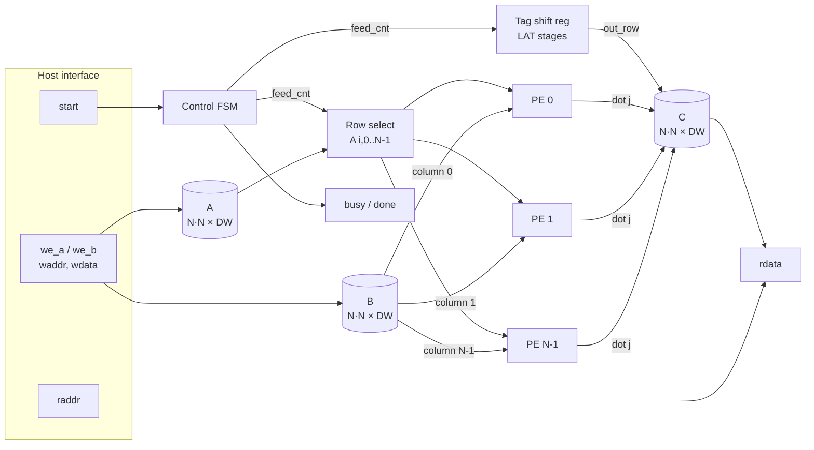
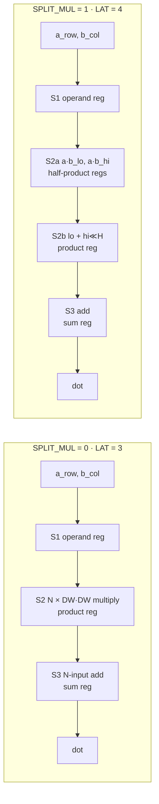
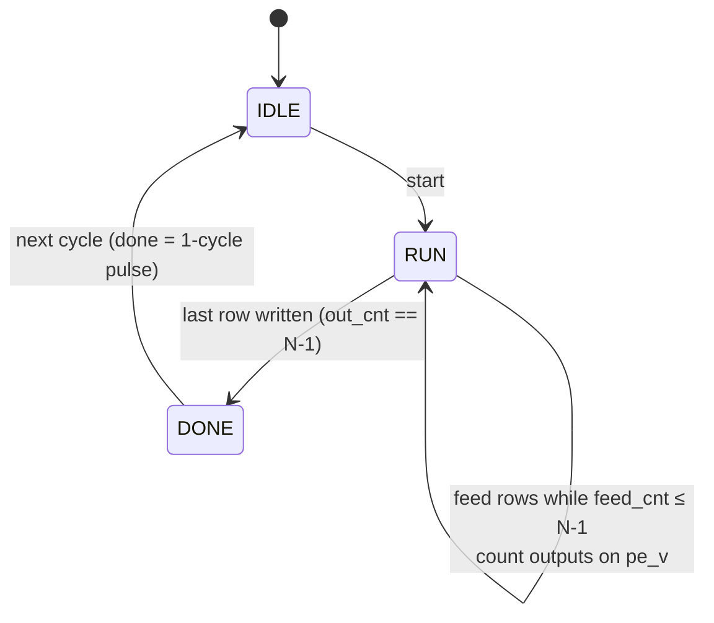

# Architecture

`mm_accel` computes C = A × B for N×N matrices of DW-bit values. N processing elements run in
parallel, one per column of B; the controller streams one row of A per cycle into all of them.
A full multiply completes in **N + 4 cycles** (N + 5 with `SPLIT_MUL=1`).



PE *j* is wired permanently to column *j* of B, so the B operand never moves. After LAT cycles
row *i* emerges from all PEs together and is written to row *i* of C. Several rows are in
flight simultaneously, giving one C row per cycle once the pipeline fills.

## Processing element — `rtl/mm_pe.sv`



`SPLIT_MUL=1` rewrites `a·b` as `a·b_lo + (a·b_hi ≪ DW/2)` and registers the two half-products.
Each multiplier's partial-product array is then half as tall, shortening the S2 path. The cost
is one cycle of latency and ~770 additional flops at N=4. Measured effect:
[implementation.md](implementation.md#design-study--split-multiplier).

## Control FSM



| Signal | Meaning |
|---|---|
| `feed_v = RUN && feed_cnt ≤ N-1` | a valid row enters the PEs this cycle |
| `tag_sr` | shift register, LAT × RW bits; carries the row index alongside the data |
| `pe_v[0]` | PE output valid — all PEs share timing, so only bit 0 is used |
| `out_cnt` | rows written to C; reaching N-1 ends the run |

The row tag travels with the data instead of being recomputed, so the controller never needs to
know the PE latency. It stays correct when `SPLIT_MUL` changes LAT.

## Cycle-level timing — N = 2, SPLIT_MUL = 0

The rising edge that samples `start` is edge 1.

| Edge | FSM | S1 (operands) | S2 (products) | S3 (dot) | Write to C | Outputs after edge |
|---|---|---|---|---|---|---|
| 1 | IDLE→RUN | – | – | – | – | busy=1 |
| 2 | RUN | row 0 | – | – | – | |
| 3 | RUN | row 1 | row 0 | – | – | |
| 4 | RUN | – | row 1 | row 0 | – | pe_v=1 |
| 5 | RUN | – | – | row 1 | **row 0** | |
| 6 | RUN→DONE | – | – | – | **row 1** | busy=0, done=1 |
| 7 | DONE→IDLE | | | | | done=0 |

`done` rises on edge **N + 4 + SPLIT_MUL**, asserted for exactly one cycle.

## Design decisions

| Decision | Rationale |
|---|---|
| One PE per column of B; A rows streamed one per cycle | All N rows in flight together; one C row per cycle after a 3-cycle fill. Simpler than a systolic array, and area is dominated by the N² multipliers either way. |
| Row tag carried in a shift register beside the data | The controller never counts PE latency; the tag arrives with the result and addresses C directly. Parameter-safe when LAT changes. |
| Reset only on control and valid flops; datapath and storage reset-free | Saves area and reset-net load. Correctness never depends on datapath contents at reset — test T0 verifies the PE valids are known-0. |
| Async active-low reset | Standard ASIC style. Declared a false path in the SDC. |
| Writes and `start` ignored unless IDLE | Protects a run in flight. Verified by tests T7, T8 and mutants M1, M2. |
| Arithmetic wraps modulo 2^DW | Fixed-width datapath, no overflow flag. Verified by test T2. |
| Combinational `raddr → rdata` readback | Simplest host interface. The SDC allocates 60 % of the period to it. Registering it would cost one cycle of read latency. |
| Flattened buses (`[k*DW +: DW]`), no multi-dimensional packed ports, no casts | Accepted by every Yosys version in the toolchain. |

### Signedness

The datapath is unsigned, but because every product is truncated to DW bits, the result is
identical to a signed (two's-complement) multiply: the low DW bits of a product are the same
under both interpretations. A host may load two's-complement values and read two's-complement
results with no RTL change. Signedness would only matter if the full 2·DW-bit product were
retained, or if the design performed comparison, arithmetic right shift or saturation.

## Interface

### Parameters

| Parameter | Default | Range | Notes |
|---|---|---|---|
| `N` | 4 | ≥ 2 | Matrix dimension. Area grows as N² (storage) plus N² multipliers. |
| `DW` | 32 | ≥ 2, even when `SPLIT_MUL=1` | Data width |
| `SPLIT_MUL` | 0 | 0 / 1 | Split-multiplier pipeline, +1 cycle latency |
| `AW`, `LAT` | derived | – | Do not override |

### Ports

| Port | Dir | Width | Description |
|---|---|---|---|
| `clk` | in | 1 | Rising-edge clock |
| `rst_n` | in | 1 | Asynchronous active-low reset |
| `we_a`, `we_b` | in | 1 | Write enables for A / B, accepted in IDLE only |
| `waddr` | in | AW = ⌈log₂N²⌉ | Row-major address `i*N + j` |
| `wdata` | in | DW | Element value |
| `start` | in | 1 | Starts a run, sampled in IDLE |
| `busy` | out | 1 | High while running |
| `done` | out | 1 | One-cycle pulse when C is valid |
| `raddr` | in | AW | Address into C |
| `rdata` | out | DW | `C[raddr]`, combinational |

### Host sequence

```
1. Hold rst_n low for at least one clock edge, then release.
2. For each x in 0..N²-1: pulse we_a with waddr=x, wdata=A[x]; same for we_b / B.
3. Pulse start for one cycle.
4. Wait for done — edge N+4+SPLIT_MUL.
5. Read C[x] by driving raddr=x and sampling rdata.
```

A and B remain loaded after a run, so step 3 may be repeated without reloading.
